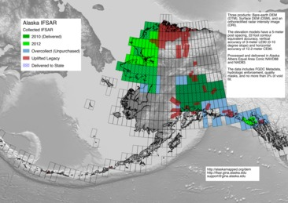

GINA SDMI IFSAR
===============

The shapefiles to help GINA keep track of the status
of the IFSAR collections in the state of Alaska.

[current status map](./maps/Alaska-IFSAR-STATUS-current.jpg "Current Status")

Currently this falls into 3 major buckets:

Legacy IFSAR
------------

IFSAR flown and collected by Intermap in the early years.  All of
this data was uplifted to public domain for the 2010 IFSAR collection.

2010 IFSAR Collection
---------------------

Interior of Alaska IFSAR collection split between two Fugro Earth Data 
and Intermap.  Majority of that collection has been purchased and delivered.

Legacy shapefile is found in: layers/legacy

2012 IFSAR Collection
---------------------

Flown but not yet delivered to the USGS or State of Alaska

Using this repository
---------------------

You can grab a copy of the latest version of this repository at:
https://github.com/gina-alaska/sdmi-ifsar/archive/master.zip

Take a look in the:

layers/general/SDMI-IFSAR-STATUS

This shapefile is my attempt at organizing the status of all of 
the new SDMI IFSAR collections. 

You will need to use the 'year' attribute to determine what coverage 
is available.  The 2010 collection is all available right now and 
the 2012 collection will be available at the end of this year.

Questions?
----------
email: support@gina.alaska.edu
