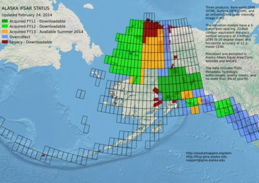

GINA SDMI IFSAR
===============

The shapefiles to help GINA keep track of the status
of the IFSAR collections in the state of Alaska.  Check out the project website at [http://alaskamapped.org/dem](http://alaskamapped.org/dem) for details on this project.

[full resolution status map](maps/Alaska-IFSAR-STATUS-current.png)

There are currently three major buckets of data tracked here:

Legacy IFSAR
------------

IFSAR flown and collected by Intermap in the early years.  All of
this data was uplifted to public domain for the 2010 IFSAR collection.

Legacy shapefile is found in: layers/legacy

2010 IFSAR Collection
---------------------

Interior of Alaska IFSAR collection split between two Fugro Earth Data 
and Intermap.  Majority of that collection has been purchased and delivered.

Reorganized 2010 data can be downloaded from ifsar.gina.alaska.edu/Data/2010/

2012 IFSAR Collection
---------------------

Partiall delivery in original format USGS or State of Alaska

Jekyll-Bootstrap ifsar-site
---------------------

Copy of the website build directory for ifsar.gina.alaska.edu is in Branch
ifsar-site. 

Using this repository
---------------------

You can grab a copy of the latest version of this repository at:
https://github.com/gina-alaska/sdmi-ifsar/archive/master.zip

Take a look in the:

layers/general/SDMI-IFSAR-STATUS

This shapefile is my attempt at organizing the status of all of 
the new SDMI IFSAR collections. 

You will need to use the 'year' attribute to determine what coverage 
is available.  The 2010 collection is all available right now and 
the 2012 collection will be available at the end of this year.

Questions?
----------
email: support@gina.alaska.edu
